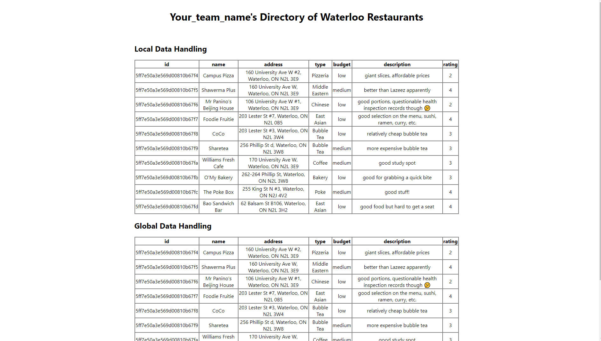

# Bootcamp: MERN Stack (REST API Backend)

This repo contains the starter-code for our bootcamp activity.

## Tech Stack

We will be using the MERN stack. These technologies are easy to learn, allow for fast development speeds, and are popularly used in Blueprint.

* Frontend: React + Redux
* Backend: Node.js + Express.js
* Database: MongoDB

## Setup

The dev environment is containerized with Docker to minimize setup efforts.

1. Install Docker Desktop (skip tutorials): [MacOS](https://docs.docker.com/docker-for-mac/install/) | [Windows (Home)](https://docs.docker.com/docker-for-windows/install-windows-home/) | [Windows (Pro, Enterprise, Education)](https://docs.docker.com/docker-for-windows/install/) | [Linux](https://docs.docker.com/engine/install/#server)
```bash
# verify your installation by running the following in a terminal
$ docker --version
$ docker-compose --version
```

2. Clone this repo and go into the project directory
```
$ git clone https://github.com/uwblueprint/bootcamp-mern-rest.git
$ cd bootcamp-mern-rest
```

3. Set up your MongoDB database (your local server will connect to this, to persist data)

    a. Create a [MongoDB Atlas](https://www.mongodb.com/cloud/atlas/register) account and sign-in

    b. Create a new project called blueprint-bootcamp (you may need to create an organization first)

    c. Click "Build a Database" > "Shared" (the free option) > "Create"

    d. Keep all default options on the "Create a cluster" page and click "Create a cluster". Wait 1-3 minutes for your cluster to be provisioned

    e. When your cluster is ready, click "Connect"

    f. Select "Add your current IP" and confirm 

    g. Create a database user and a password (avoid special characters). **Please remember this password**. Then click "choose a connection method"

    h. Click "Connect your application". Ensure the driver is set for Node.js version 3.6 or later (this should be the default). Then copy the connection string (should look something like `mongodb+srv://...`)

4. Edit your backend code to connect with the MongoDB database
    a. In `/backend/.env.sample`, replace `<your-database-url>` with the connection string. 

    b. In the connection string, replace `<username>` with the username set ealier and replace `<password>` with the password you set earlier as well.

    c. In the connection string, just after `.... mongodb.net/`, insert `bootcamp` just before `?retryWrites=true&w=majority`. So the end of the string should look like this: `.. mongodb.net/bootcamp?retryWrites=true&w=majority`.

    d. Also change `MONGO_INITDB_ROOT_USERNAME` and `MONGO_INITDB_ROOT_PASSWORD` to the correct values set earlier.

    d. Rename `/backend/.env.sample` to `/backend/.env`

    e. In `backend/persistence/initDb.js`, set `SEED_DB` to `true`. This will populate your database with some fake data we created upon start up

5. Run the application
```
$ docker-compose up --build
```
You should set `SEED_DB` back to `false` now.

6. Go to http://localhost:3000 in your browser. You should see this:



## Useful Commands for Development

To first setup the application run the following command:

```
$ docker-compose up --build
```

On subsequent runs you can omit the --build tag

```
$ docker-compose up
```

Keep in mind that both the frontend and backend have hot reload enabled so you will rarely need to restart the application.

## Warm Up

**Skip this if you are familiar with how to make HTTP Requests**

Before starting the tasks, let's try adding an entry to the existing Restaurant table.

If we look at `/backend/routes/restaurant.js`, we can see each endpoint defined as its own function.

Reading the comments, if we want to create a restaurant, we will need to trigger the code in `router.post("/", ...)` by making a `POST` request to the *path* `/`. Note the path is relative to the root URL that we configured for this router in `server.js`, so the full path is actually `/api/restaurants/`. We can usually omit trailing "/"s in URLs.

If you look in the file `server.js`, you see that `app.listen(5000, ...)` tells us the server is listening for requests on *port* `5000`.

Since we are running this *locally*, we can put all these pieces of information together into one url: `http://localhost:5000/api/restaurants` .

Try downloading [Postman](https://www.postman.com/), and make a `POST` request to `http://localhost:5000/api/restaurants`. You can read the *Tip* section below or the documentation to learn more about Postman.

**Hint**: At this point, you may be wondering how will you specify the fields necessary to create a Restaurant. When we look at the code in `restaurant.js`, we see a `RestaurantRequestResource` being created to handle the HTTP request body (`req.body`). Try reading that & the comments associated.

## Your Tasks

Following the starter-code's pattern, complete these tasks:

Currently, our restaurant directory maintains a singular list of restaurants.
Suppose we now want the ability to create restaurant groups (e.g. "Uni Plaza", "Cafes", "Open Late", etc.).

A single group can contain multiple restaurants, and a single restaurant can be part of multiple groups.

A `RestaurantGroup` has these fields: `id`, `name`, `description`, `restaurantIds`

1. Using the existing code as a template, create REST endpoints for `RestaurantGroup`, supporting Create & Retrieve operations.

    a. To support _creating_ groups, make an endpoint called `/groups` which handles a `POST` request. It will accept a `name`, `description`, and `restaurantIds` as the request body to create a new Restaurant Group. It will return an `id` which corresponds to the newly created Restaurant Group if successful

    **Sample Request Body**
    ```
        {
            "name" : "example_name",
            "description" : "example description",
            "restaurantIds" : [
                "restaurant_id_one",
                "restaurant_id_n"
            ]
        }
    ```

    **Successful Response Body**
    ```
        {
            "id" : "example_group_id"
        }
    ```

    b. To support _retrieving_ a group, make an endpoint called `/groups/:id` which handles a `GET` request. It will accept an `id` as the request parameter and return the Restaurant Group data corresponding to that `id`

    **Sample Response Body** for `/groups/example_group_id`
    ```
        {
            "id" : "example_group_id"
            "name" : "example_name",
            "description" : "example description",
            "restaurantIds" : [
                "restaurant_id_one",
                "restaurant_id_n"
            ]
        }
    ```

2. Display `RestaurantGroup` data in the frontend (try to reuse existing components to save time, don't worry about design and appearance)

3. Modify the API `GET` response so that it includes full restaurant information, not just the ids

### Tip

For some help with debugging your work, you can download [Postman](https://www.postman.com/)! Postman is a tool which allows developers to test endpoints with different requests, and view its responses. This will allow you to write and test the backend code without making any changes to the frontend yet.

And please **ASK FOR HELP**, if you're stuck!

### Extensions

1. To support _updating_ a group, make an endpoint called `/groups` which handles a `PUT` request. It will accept an `id`, `name`, `description`, and `restaurantIds` and edit the properties of the Restaurant Group with the corresponding `id`. It will return the `id` of the Restaurant Group if successful

2. Add an endpoint to delete `RestaurantGroups`

3. Modify the restaurant deletion logic so that deleting a restaurant will result in its removal from all the groups that it was part of
